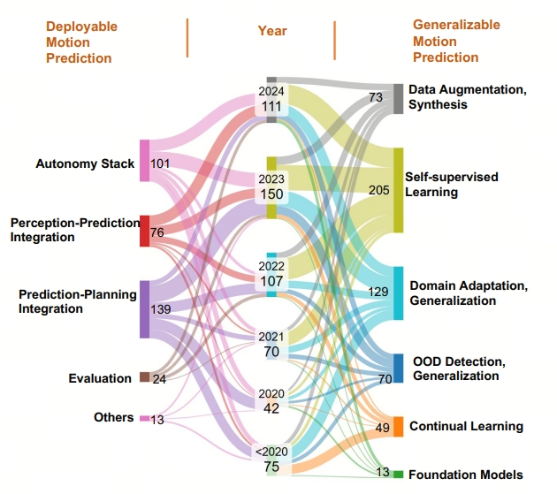

# Awesome-Deployable-Generalizable-Motion-Prediction

[](https://awesome.re)

<!--  -->



This is the partner repository for the survey paper "Trends in Motion Prediction Toward Deployable and Generalizable Autonomy: A Revisit and Perspectives". The authors hope this repository can act as a quick reference for roboticists who wish to read the relevant papers and implement the associated methods. The organization of this readme follows Figure 2 in the paper (shown above) and is thus divided into deplyable motion prediction and generalizable motion prediction, highlighting the evolution and interconnection of deployable motion prediction and generalizable
motion prediction research from before 2020 to 2024.

We welcome contributions to this repository to add more resources. Please submit a pull request if you want to contribute!

## Table of Contents

- [Survey](#survey)
- [Perception Uncertainty](#perception-uncertainty)
- [Perceptuin-Prediction Intergration](#perceptuin-prediction-intergration)
- [Prediction Uncertainty](#prediction-uncertainty)
- [Prediction-Planning Intergration](#prediction-planning-intergration)
- [Evaluation](#evaluation)
- [Self-Supervised Learning](#self-supervised-earning)
- [Domain Generalization and Adaption](#domain-generalization-and-adaption)
- [Continual Learning](#continual-learning)
- [Out-of-Distribution Detection and Generalization](#out-of-distribution-detection-and-generalization)
- [Data Augmentation and Synthesis](#data-augmentation-and-synthesis)
- [Foundation Model](#foundation-model)


## Survey

This repository is largely based on the following paper:

**[Trends in Motion Prediction Toward Deployable and Generalizable Autonomy: A Revisit and Perspectives]()**
<br />
Letian Wang,
Marc-Antoine Lavoie,
Sandro Papais,
Barza Nisar,
Yuxiao Chen,
Wenhao Ding,
Boris Ivanovic,
Hao Shao,
Abulikemu Abuduweili,
Evan Cook,
Yang Zhou,
Peter Karkus,
Jiachen Li,
Changliu Liu,
Marco Pavone,
Steven Waslander
<br />

If you find this repository helpful, please consider citing:
```bibtex
@misc{wang2025trendsmotionpredictiondeployable,
      title={Trends in Motion Prediction Toward Deployable and Generalizable Autonomy: A Revisit and Perspectives}, 
      author={Letian Wang and Marc-Antoine Lavoie and Sandro Papais and Barza Nisar and Yuxiao Chen and Wenhao Ding and Boris Ivanovic and Hao Shao and Abulikemu Abuduweili and Evan Cook and Yang Zhou and Peter Karkus and Jiachen Li and Changliu Liu and Marco Pavone and Steven Waslander},
      year={2025},
      eprint={2505.09074},
      archivePrefix={arXiv},
      primaryClass={cs.RO},
      url={https://arxiv.org/abs/2505.09074}, 
}
```


## Deployability in Motion Prediction

### Perception Uncertainty
#### Detection Uncertainty
* Towards safe autonomous driving: Capture uncertainty in the deep neural network for lidar 3d vehicle detection []()
* Lasernet: An efficient probabilistic 3d object detector for autonomous driving []()
* Bayesod: A bayesian approach for uncertainty estimation in deep object detectors []()

#### Traking Uncertainty
* SWTrack: Multiple hypothesis sliding window 3D multi-object tracking []()
* UncertaintYtrack: exploiting detection and localization uncertainty in multi-object tracking []()
* Whose track is it anyway? Improving robustness to tracking errors with affinity-based trajectory prediction []()
* MTP: Multi-hypothesis tracking and prediction for reduced error propagation []()

#### Mapping Uncertainty
* Producing and leveraging online map uncertainty in trajectory prediction []()

#### Occupancy Uncertainty
* Pasco: Urban 3d panoptic scene completion with uncertainty awareness []()
* OCCUQ: Exploring Efficient Uncertainty Quantification for 3D Occupancy Prediction []()

### Perceptuin-Prediction Intergration

#### Prediction for Perception
* Modar: Using motion forecasting for 3d object detection in point cloud sequences
* Standing between past and future: Spatio-temporal modeling for multi-camera 3d multi-object tracking []()
* Predict to Detect: Prediction-guided 3D Object Detection using Sequential Images []()

#### Perception for Prediction
* Producing and leveraging online map uncertainty in trajectory prediction []()
* Propagating state uncertainty through trajectory forecasting []()
* Pasco: Urban 3d panoptic scene completion with uncertainty awareness []()
* Heterogeneous-agent trajectory forecasting incorporating class uncertainty []()
* Fiery: Future instance prediction in bird's-eye view from surround monocular cameras []()

#### Joint Perception and Prediction
* Fast and furious: Real time end-to-end 3d detection, tracking and motion forecasting with a single convolutional net []()
* Intentnet: Learning to predict intention from raw sensor data []()
* Pnpnet: End-to-end perception and prediction with tracking in the loop []()
* Fiery: Future instance prediction in bird's-eye view from surround monocular cameras []()
* Vip3d: End-to-end visual trajectory prediction via 3d agent queries []()
* Detra: A unified model for object detection and trajectory forecasting []()
* Enhanced motion forecasting with visual relation reasoning []()
* Predict to detect: Prediction-guided 3d object detection using sequential images []()
* Implicit occupancy flow fields for perception and prediction in self-driving []()
* Cam4docc: Benchmark for camera-only 4d occupancy forecasting in autonomous driving applications []()
* Uno: Unsupervised occupancy fields for perception and forecasting []()
* Implicit occupancy flow fields for perception and prediction in self-driving []()
* Planning-oriented autonomous driving []()

### Prediction Uncertainty
#### Quantifying Prediction Uncertainty
* Uncertainty-aware short-term motion prediction of traffic actors for autonomous driving []()
* Social lstm: Human trajectory prediction in crowded spaces []()
* Socially-compatible behavior design of autonomous vehicles with verification on real human data []()
* Probabilistically safe robot planning with confidence-based human predictions []()
* Prediction-uncertainty-aware decision-making for autonomous vehicles []()
* Uncertainty-aware driver trajectory prediction at urban intersections []()
* Learning to forecast aleatoric and epistemic uncertainties over long horizon trajectories []()
* De-tgn: Uncertainty-aware human motion forecasting using deep ensembles []()

#### Calibrating Prediction Uncertainty
* Probabilistic outputs for support vector machines and comparisons to regularized likelihood methods []()
* Transforming classifier scores into accurate multiclass probability estimates []()
* On calibration of modern neural networks []()
* Sonic: Safe social navigation with adaptive conformal inference and constrained reinforcement learning []()
* Safe planning in dynamic environments using conformal prediction []()
* Multi-modal conformal prediction regions by optimizing convex shape templates []()
* Sample-efficient safety assurances using conformal prediction []()

#### Reducing prediction Uncertainty
* Probabilistically safe robot planning with confidence-based human predictions []()
* Socially-compatible behavior design of autonomous vehicles with verification on real human data []()
* Transferable and adaptable driving behavior prediction []()
* Information gathering actions over human internal state []()
* Agentformer: Agent-aware transformers for socio-temporal multi-agent forecasting []()
* Jfp: Joint future prediction with interactive multi-agent modeling for autonomous driving []()


### Prediction-Planning Intergration
#### Planning for Prediction
* Socially-compatible behavior design of autonomous vehicles with verification on real human data []()
* Pip: Planning-informed trajectory prediction for autonomous driving []()
* Implicit occupancy flow fields for perception and prediction in self-driving []()

#### Prediction for Planning
* Scept: Scene-consistent, policy-based trajectory predictions for planning []()
* 


#### Joint Prediction and Planning
* Socially-compatible behavior design of autonomous vehicles with verification on real human data []()
* Trajectron++: Dynamically-feasible trajectory forecasting with heterogeneous data
* Dtpp: Differentiable joint conditional prediction and cost evaluation for tree policy planning in autonomous driving []()
* MATS: An interpretable trajectory forecasting representation for planning and control []()
* Tree-structured policy planning with learned behavior models []()
* Interactive joint planning for autonomous vehicles []()
* Gameformer: Game-theoretic modeling and learning of transformer-based interactive prediction and planning for autonomous driving []()
* Reasoning multi-agent behavioral topology for interactive autonomous driving []()
* Ppad: Iterative interactions of prediction and planning for end-to-end autonomous driving []()
* Interaction-aware trajectory prediction and planning for autonomous vehicles in forced merge scenarios []()


### Evaluation
#### Perception-Aware Prediction Evaluation
* Propagating state uncertainty through trajectory forecasting []()

#### Planning-Aware Prediction Evaluation
*  Rethinking trajectory forecasting evaluation []()
* Navsim: Data-driven non-reactive autonomous vehicle simulation and benchmarking []()

#### Close-Loop Evaluation
* What truly matters in trajectory prediction for autonomous driving? []()
* Parting with misconceptions about learning-based vehicle motion planning []()

## Gneralization in Motion Prediction

### Self-Supervised Learning
####  Self-Supervised Learning for Trajectory Prediction
* Forecast-mae: Self-supervised pre-training for motion forecasting with masked autoencoders
* Traj-mae: Masked autoencoders for trajectory prediction
* Sept: Towards efficient scene representation learning for motion prediction
* Smartpretrain: Model-agnostic and dataset-agnostic representation learning for motion prediction
* Pretram: Self-supervised pre-training via connecting trajectory and map
* Multi-agent driving behavior prediction across different scenarios with self-supervised domain knowledge
* PreCLN: Pretrained-based contrastive learning network for vehicle trajectory prediction
* Ssl-lanes: Self-supervised learning for motion forecasting in autonomous driving
* Social-ssl: Self-supervised cross-sequence representation learning based on transformers for multi-agent trajectory prediction
* Self-supervised pretraining based on noise-free motion reconstruction and semantic-aware contrastive learning for human motion prediction
* Pedestrian crossing action recognition and trajectory prediction with 3d human keypoints
* Redmotion: Motion prediction via redundancy reduction
* Exploiting map information for self-supervised learning in motion forecasting
* Pre-training on synthetic driving data for trajectory prediction

#### Point Cloud Forecasting
* Temporal lidar frame prediction for autonomous driving
* Inverting the pose forecasting pipeline with SPF2: Sequential pointcloud forecasting for sequential pose forecasting
* Monet: Motion-based point cloud prediction network
* Self-supervised point cloud prediction using 3d spatio-temporal convolutional networks
* S2net: Stochastic sequential pointcloud forecasting
* Differentiable raycasting for self-supervised occupancy forecasting
* Point cloud forecasting as a proxy for 4d occupancy forecasting
* Pcpnet: An efficient and semantic-enhanced transformer network for point cloud prediction
* ATPPNet: Attention based temporal point cloud prediction network
* Copilot4d: Learning unsupervised world models for autonomous driving via discrete diffusion
* Occworld: Learning a 3d occupancy world model for autonomous driving
* Visual point cloud forecasting enables scalable autonomous driving

#### Video Generation and Scene Reconstruction
* Learning a driving simulator
* Drivegan: Towards a controllable high-quality neural simulation
* Drivedreamer: Towards real-world-drive world models for autonomous driving
* Adriver-i: A general world model for autonomous driving
* Magicdrive: Street view generation with diverse 3d geometry control
* Gaia-1: A generative world model for autonomous driving
* Driving into the future: Multiview visual forecasting and planning with world model for autonomous driving
* Wovogen: World volume-aware diffusion for controllable multi-camera driving scene generation
* Genad: Generative end-to-end autonomous driving
* Drivingdojo dataset: Advancing interactive and knowledge-enriched driving world model
* Vista: A generalizable driving world model with high fidelity and versatile controllability
* Urban radiance fields
* Block-nerf: Scalable large scene neural view synthesis
* Streetsurf: Extending multi-view implicit surface reconstruction to street views
* Neural fields meet explicit geometric representations for inverse rendering of urban scenes
* Hypernerf: A higher-dimensional representation for topologically varying neural radiance fields
* EmerNeRF: Emergent spatial-temporal scene decomposition via self-supervision
* Drivinggaussian: Composite gaussian splatting for surrounding dynamic autonomous driving scenes
* Occnerf: Self-supervised multi-camera occupancy prediction with neural radiance fields
* Unipad: A universal pre-training paradigm for autonomous driving
* Selfocc: Self-supervised vision-based 3d occupancy prediction
* Scube: Instant large-scale scene reconstruction using voxsplats
* Distillnerf: Perceiving 3d scenes from single-glance images by distilling neural fields and foundation model features
* STORM: Spatio-temporal reconstruction model for large-scale outdoor scenes


### Domain Generalization and Adaption
#### Designing and Learning Invariant Feature
* Improving the generalizability of trajectory prediction models with frenet-based domain normalization
* Scenario-transferable semantic graph reasoning for interaction-aware probabilistic prediction
* Hierarchical adaptable and transferable networks (hatn) for driving behavior prediction
* Transferable and adaptable driving behavior prediction
* Adaptive pedestrian trajectory prediction via target-directed angle augmentation
* Spatial-temporal-spectral lstm: A transferable model for pedestrian trajectory prediction
* Learning trajectory dependencies for human motion prediction
* Improving transferability for cross-domain trajectory prediction via neural stochastic differential equation
* Singulartrajectory: Universal trajectory predictor using diffusion model
* Belfusion: Latent diffusion for behavior-driven human motion prediction
* Generative model‐enhanced human motion prediction
* Adaptive trajectory prediction via transferable gnn
* Adaptive and simultaneous trajectory prediction for heterogeneous agents via transferable hierarchical transformer network
* Bridging the gap: Improving domain generalization in trajectory prediction
* Causal-based time series domain generalization for vehicle intention prediction

#### Domain-Specific Modules
* Towards robust and adaptive motion forecasting: A causal representation perspective
* Motion style transfer: Modular low-rank adaptation for deep motion forecasting
* LoRD: Adapting Differentiable Driving Policies to Distribution Shifts
* Adapting to length shift: Flexilength network for trajectory prediction
Improving transferability for cross-domain trajectory prediction via neural stochastic differential equation

#### Causal Learning
* Human trajectory prediction via counterfactual analysis
* Towards robust and adaptive motion forecasting: A causal representation perspective
* CILF: Causality inspired learning framework for out-of-distribution vehicle trajectory prediction
* Generative causal representation learning for out-of-distribution motion forecasting
* Causal intervention for human trajectory prediction with cross attention mechanism
* Cadet: a causal disentanglement approach for robust trajectory prediction in autonomous driving

#### Few-Shot and Test-Time Adaptation
* Online adaptation of neural network models by modified extended kalman filter for customizable and transferable driving behavior prediction
* Expanding the deployment envelope of behavior prediction via adaptive meta-learning
* T4p: Test-time training of trajectory prediction via masked autoencoder and actor-specific token memory
* Fast adaptation trajectory prediction method based on online multisource transfer learning
* Online multi-agent forecasting with interpretable collaborative graph neural networks
* Fast user adaptation for human motion prediction in physical human–robot interaction
* Metatraj: meta-learning for cross-scene cross-object trajectory prediction
* Online adaptive temporal memory with certainty estimation for human trajectory prediction


### Continual Learning
* Gradient episodic memory for continual learning
* Continual interactive behavior learning with traffic divergence measurement: A dynamic gradient scenario memory approach
* Lifelong vehicle trajectory prediction framework based on generative replay
* Continual learning-based trajectory prediction with memory augmented networks
* Mantra: Memory augmented networks for multiple trajectory prediction
* Fast adaptation trajectory prediction method based on online multisource transfer learning
* Continual Learning for Motion Prediction Model via Meta-Representation Learning and Optimal Memory Buffer Retention Strategy
* Continual multi-agent interaction behavior prediction with conditional generative memory
Continual pedestrian trajectory learning with social generative replay
* Adaptive trajectory prediction without catastrophic forgetting
* Improving pedestrian prediction models with self-supervised continual learning

### Out-of-Distribution Detection and Generalization
* LoRD: Adapting Differentiable Driving Policies to Distribution Shifts
* Anomaly detection in trajectory data with normalizing flows
* Interpretable self-aware neural networks for robust trajectory prediction
* Failure detection for motion prediction of autonomous driving: An uncertainty perspective
* Task-relevant failure detection for trajectory predictors in autonomous vehicles
* Joint out-of-distribution detection and uncertainty estimation for trajectory prediction
* On complementing end-to-end human behavior predictors with planning
* Improving vehicle trajectory prediction with online learning 
* Adaptive prediction ensemble: Improving out-of-distribution generalization of motion forecasting
* RuleFuser: An evidential bayes approach for rule injection in imitation learned planners and predictors for robustness under distribution shifts
* A system-level view on out-of-distribution data in robotics


### Data Augmentation and Synthesis
#### Data Augmentation
* Scene transformer: A unified architecture for predicting multiple agent trajectories
* Hpnet: Dynamic trajectory forecasting with historical prediction attention
* Query-centric trajectory prediction
* Smartrefine: A scenario-adaptive refinement framework for efficient motion prediction
* Fixing data augmentation to improve adversarial robustness

#### Data Synthesis
* Pre-training on synthetic driving data for trajectory prediction
* Metadrive: Composing diverse driving scenarios for generalizable reinforcement learning
* Deep imitation learning for autonomous driving in generic urban scenarios with enhanced safety
* Waymax: An accelerated, data-driven simulator for large-scale autonomous driving research
* A new multi-vehicle trajectory generator to simulate vehicle-to-vehicle encounters
* Cmts: A conditional multiple trajectory synthesizer for generating safety-critical driving scenarios
* Scenegen: Learning to generate realistic traffic scenes
* Trafficsim: Learning to simulate realistic multi-agent behaviors
* Trafficgen: Learning to generate diverse and realistic traffic scenarios
* Guided conditional diffusion for controllable traffic simulation
* Realgen: Retrieval augmented generation for controllable traffic scenarios
* Learning to collide: An adaptive safety-critical scenarios generating method
* Multimodal safety-critical scenarios generation for decision-making algorithms evaluation
* Cat: Closed-loop adversarial training for safe end-to-end driving
* Advsim: Generating safety-critical scenarios for self-driving vehicles
* Advdo: Realistic adversarial attacks for trajectory prediction
* On adversarial robustness of trajectory prediction for autonomous vehicles
* Language-guided traffic simulation via scene-level diffusion
* Language-driven interactive traffic trajectory generation
* Promptable closed-loop traffic simulation


### Foundation Model

#### Scale Up the Data
* Opentraj: Assessing prediction complexity in human trajectories datasets []()
* The atlas benchmark: An automated evaluation framework for human motion prediction []()
* trajdata: A unified interface to multiple human trajectory datasets []()
* Scenarionet: Open-source platform for large-scale traffic scenario simulation and modeling []()
* Unitraj: A unified framework for scalable vehicle trajectory prediction []()
* Smartpretrain: Model-agnostic and dataset-agnostic representation learning for motion prediction []()
#### Scale Up the Model
* Scaling laws for neural language models []()
* Training compute-optimal large language models []()